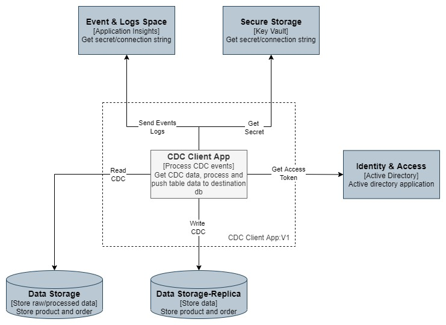

# Change Data Capture (CDC) Client application

CDC Client is console application to get cdc data generated by source MS SQL Server database and push table data into destination database's table. Destination tables are same as source table but without any constrains.

[]

# Prerequisites

- Azure subscription
- Azure SQL database Source and Destination (DB schema at `.\DbSchema\`)
- Azure Key Vault
- Azure application insights
- Store Source and destination connection string in key vault
- Store application insights connection string in key vault
- Azure AD application with `key vault reader and secret user` rights to azure key vault resource
- .Net 6.0 framework

# Framework & Technology

.Net 6.0 Console application

# Configuration

It requires below configuration in `./Configurations/appsettings.json` file

### Azure Connection configuration

- ApplicationId: Azure AD's application id (Application (client) ID)
- AuthenticationKey: Azure AD's application authentication key (Generated in application's certificates & secrets section)

### Key Vault configuration

- Url: Azure key vault url
- SourceDbKey: Source db's key name in key vault
- DestinationDbKey: Destination db's key name in key vault
- ApplicationInsightsKey: Application insights key name in key vault

### Log configuration

- Console:LogLevel: Set logging level as required for console logs, Acceptable values are "Trace, Debug, Information, Warning, Error, Critical, None".
  more information about log level https://learn.microsoft.com/en-us/aspnet/core/fundamentals/logging/?view=aspnetcore-8.0#log-level

# Artifacts

### Build project

```
dotnet build --configuration Release
```

### Publish project

```
dotnet publish --configuration Release
```

### Logging

Console logs are generated as per logging configuration.

### Application Insights

- It generates and register events on azure application insights.
- To view events please login azure and navigate to application insights resource.

# Run Project

\*Please make sure all configuration is updated before running

- Go to publish folder from command prompt `AzureCdcClientApp\bin\Release\net6.0\publish\`
- Run below command
  ```
  .\AzureCdcClientApp.exe
  ```
